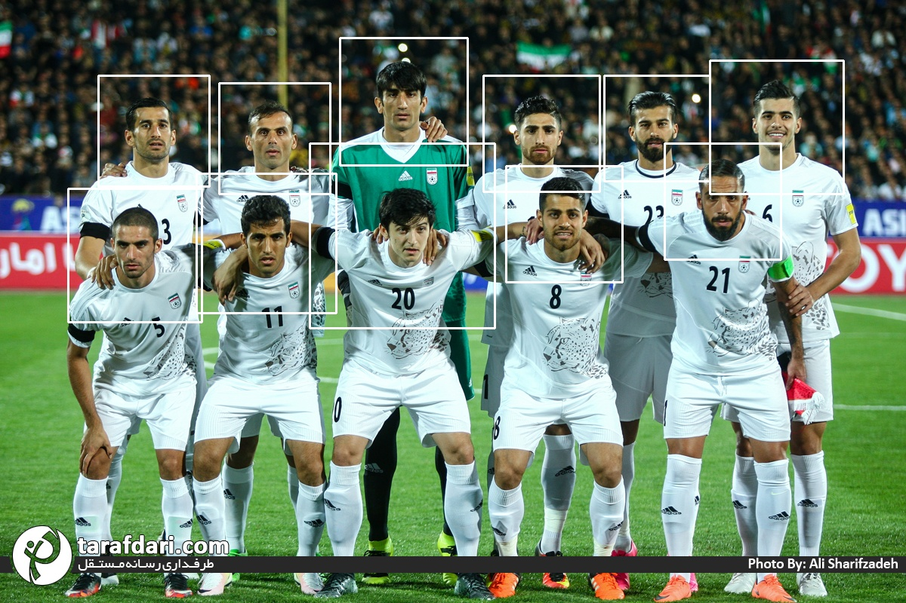
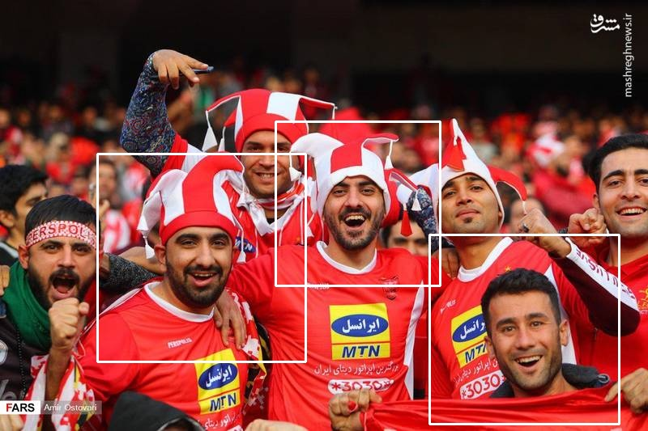
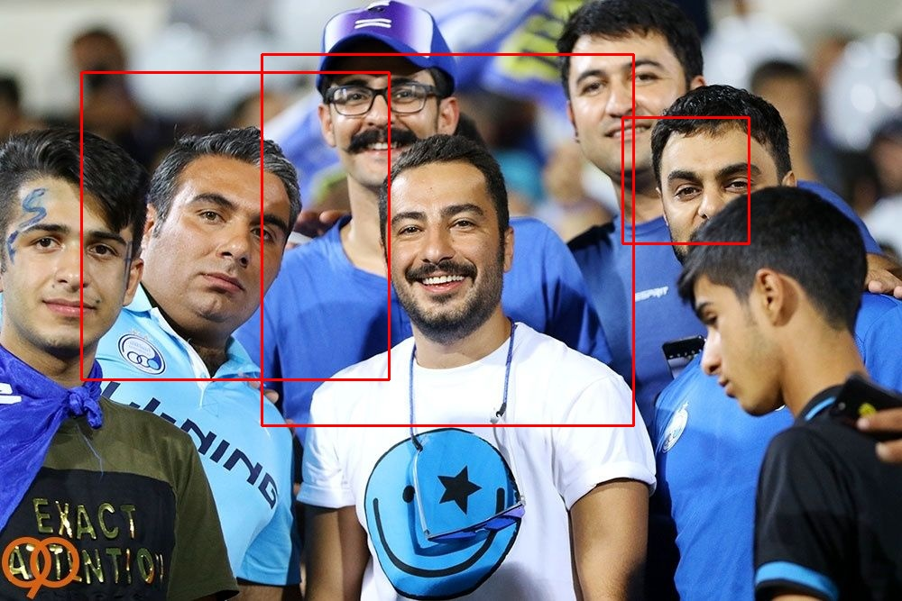

# **Face Detection Using HOG**

The histogram of oriented gradients **(HOG)** is a feature descriptor used in computer vision and image processing for the purpose of object detection. The technique counts occurrences of gradient orientation in localized portions of an image.

The essential thought behind the histogram of oriented gradients descriptor is that local object appearance and shape within an image can be described by the distribution of intensity gradients or edge directions. The image is divided into small connected regions called cells, and for the pixels within each cell, a histogram of gradient directions is compiled. The descriptor is the concatenation of these histograms.

In this project, I implement a Face Detection model with HOG descriptor and run this model on three images. 

In this project, you will get familiar with:
- HOG
- SVM
- Tuning
- Sliding Window
- IOU

Image1: 

Image2: 

Image3: 

For face images, I use LWF dataset. 
